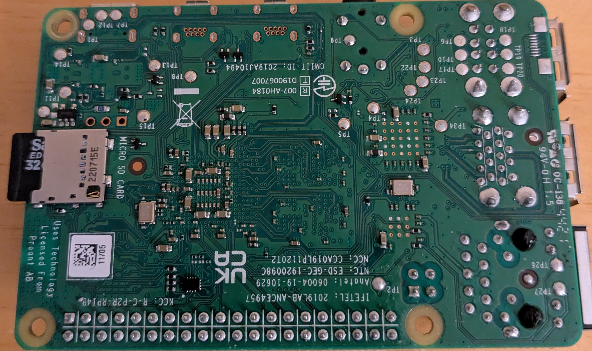
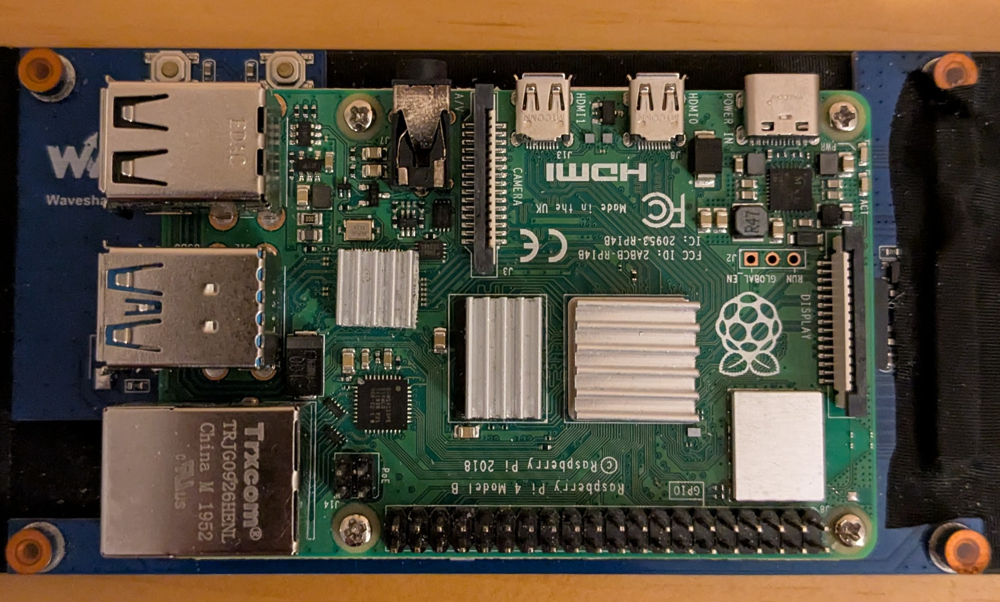
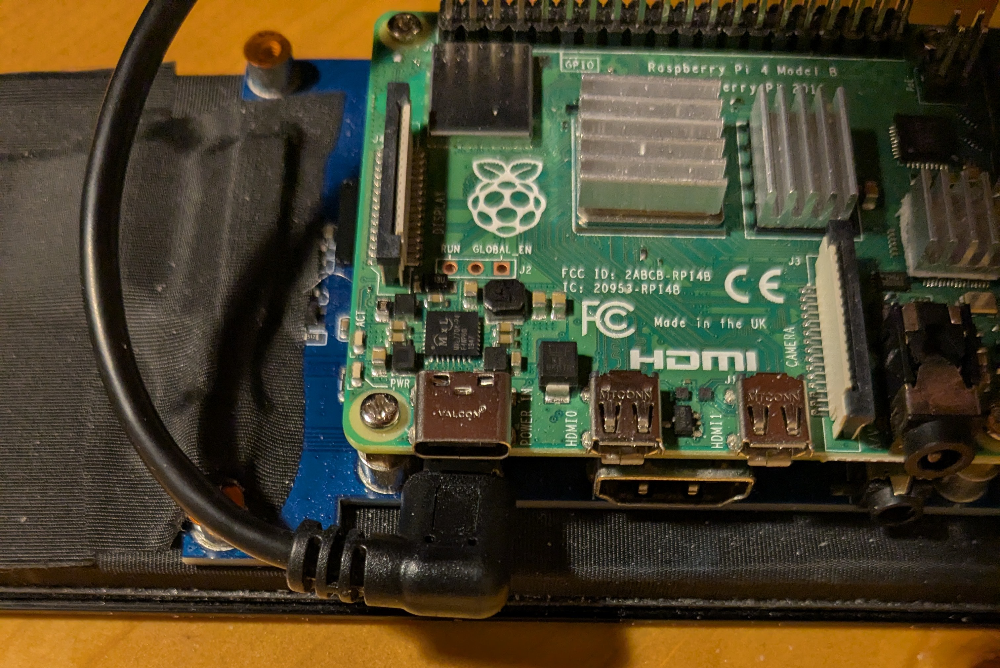
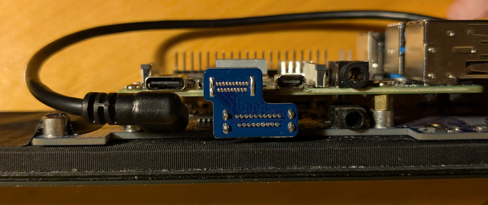
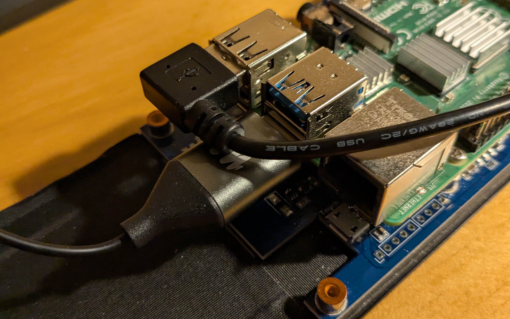
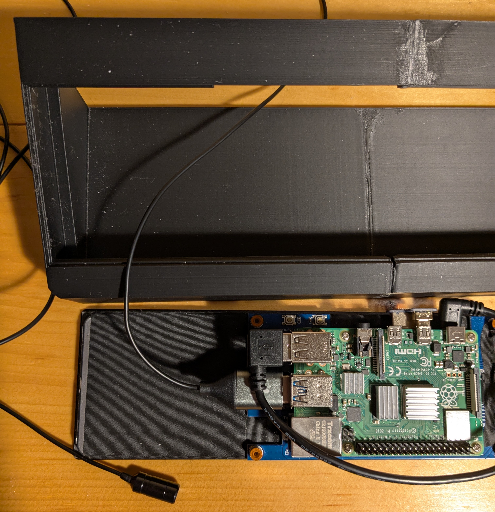
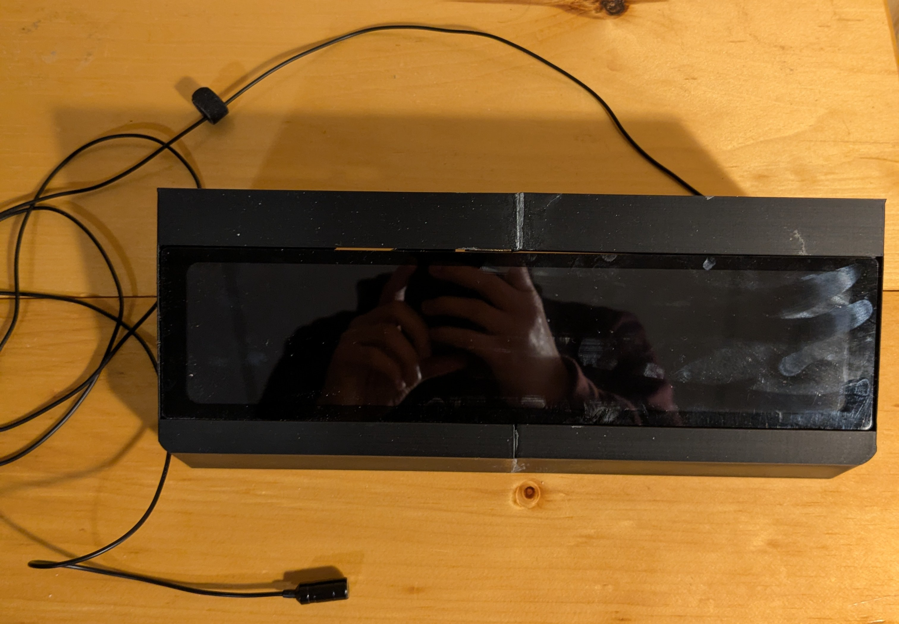
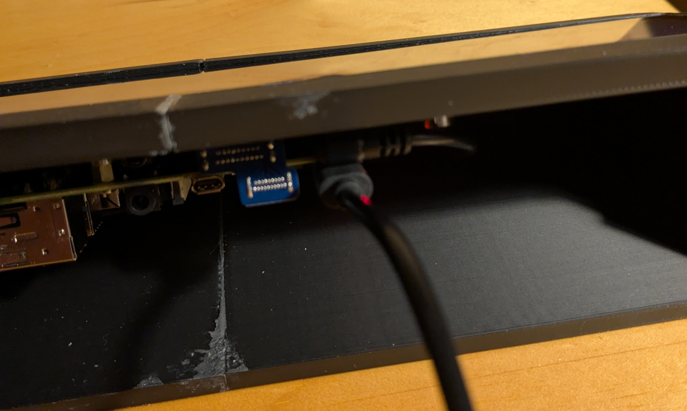

# AI Speech to Text transcription

The Live Transcription Device is designed to take speech from a user and turn it into text that will be displayed on a screen using vosk. This is a raspberry pi based and requires these components

- Raspberry Pi 4 Model B
- Maono AU-UL10 USB Lavalier Microphone
- 11.9 inche waveshare LCD screen
- 16 GB < microSD card
- USB-C cable
- Micro-HDMI to HDMI connector
- SD card reader
- 3D printer

before starting the assembly make sure that the SD card has a version of Raspberry Pi OS Bullseye lite installed on it. This can be done by using the raspberry pi imager. to get the imager go to https://www.raspberrypi.com/software/ and downlaod the imager there. from here follow these steps:

1. for raspbery pi device click the chose button and select raspberry pi 4
2. for operating system click the choose os button
3. click Raspberry Pi OS (other) option then click raspberry pi OS (legacy, 64-bit ) Lite
4. click chose storage andd select your SD card
5. click edit settings and change the general settings for the username and password to what you want
6. Make sure SSH is enabled under services
7. click yes then click ok

After the raspberry pi OS image will be flashed to that SD card. once done edit the config.txt file to have the same content as the one in this repo so that when you connect the screen the raspberry pi will display to it.

## Assembly

The device can be assembled using the following steps:

1. inserting the micro SD card into the back of the raspberry pi

2. the raspberry pi board is the be screwed into the back of the waveshare LCD screen via 4 Philips screws.

3. The LCD screen is then powered by a micro-USB to USB-B cable. The micro-USB end connects to the LCD screen and the USB-B end connects to the top USB 2.0 port on the raspberry pi which is indicated by a black port.

4. Using the HDMI to micro HDMI connector. Insert the HDMI end into the waveshare screen and the micro HDMI end into the raspberry pi.

5. The microphone is then connected to the raspberry pi by USB-B. to connect it insert the USB-B part into the bottom USB-3.0 port which is indicated by a blue port. Make sure the cable goes through the enclosure.

6.	Insert the device into the enclosure through the front of the enclosure. 

7.	To the power the entire device. A USB-C  power supply must be used. This power supply provides ~5V to the device. Plug the USB-C end into the raspberry pi and the plug into the wall.

Thats it! when all the programs are loaded into the device and set to start on boot up then you wwill have a fully working AI speech to text chatbot.

## Software

as previously mentioned the operating system that this ddevice is running on is raspberry pi OS bullseye lite. this is a GUI-less OS so it consumes less memory than the full desktop version (although it will run on that too). 

If the device is connectedd to network or you computer thorugh a CAT5/6 cable and is properly setup you should be able to ssh into the device. to do this sue the command `ssh {pi's username}@{pi's ip address}`. if using a cat5/6 cable the ip address will be `raspberrypi.local`. you will be promted to enter a password.

to start with run the command `sudo apt-get update && sudo apt-get -y upgrade`. this will install all the latest security updates. Next the linux packages you will need are:

- PortAudio - this is driver that allows for the recoding and playing of audio oon the raspberry pi as well as other OS's mention on their website https://www.portaudio.com/. to insstall use `sudo apt install -y portaudio19-dev`. 

- lightdm - This is a display manager and is required to auto boot into the window manager you will install later. too install this use `sudo apt install -y lightdm`

- Joe's Window Manager (jwm) - A light weight window manager that is needd to run the GUI iinterrface. To install use `sudo apt install -y jwm`

now use the command `sudo raspi-config` and in system options -> Boot / Auto Login select Console Autologin. repeat and select Desktop Autologin. Now reboot and you will auto boot into jwm.

Now for the python dependencies you will need to install:

- sounddevice: this is a python library that will allow you to stream audio from a microphone. this library allows you to utilize callback functions for continous audio recording

- vosk: This library allows you to utilize the vosk transcription models that are in https://alphacephei.com/vosk/models. these models are neural networks that model acoustics and sequences to what is said to predict what the text output would be

- Pillow: This library allows you manipulate images required for the NSCC logo

- Tkinter: A light weight GUI library to render the text to the screen. install with `sudo apt install -y python3-tk`

- word2number: Tis library will convert written numbers like one to its numeric counterpart 1.

to install these dependencies use the command `pip install word2number Pillow Vosk soundddevice`.

Now if you download interface.py, Vosk_to_text.py, and pictures/ from the github repo and vosk-model-small-en-us-0.15 from the previously mentioned website you should be able to run the app.

## How Does It Work

### Sounddevice

The device captures audio from a microphone that is then transcribed and sent back to the screen. The audio is captured using the sounddevice library at 16 kHz at a block size of 1024 samples per block. The duration of each sample can be calculated as:

$$Sample\;Duration = \frac{block\;size}{sample\;rate} = \frac{1024\;samples}{16000\;Hz} = 0.064\;sec$$

these variables are important to take into consideration. Changing the sample rate will change the granuilaity of the audio data. if it increase it will have more detail but will fill up more blocks in the same amount of time increasing cpu load and vice versa. Changing the block size will also change the latency as the device will have to process larger or smaller blocks. You also have too take into account that by chnage the block size you will be changing how many blocks will be created which also need to be processed.

There is also the channel which is set to 1 meaning mono sound. if you wanted stereo sound change this to 2

when the audio is read in by sounddevice it is then stored in an audio queue  waiting to be transcribed.

### Vosk

Vosk will take the audio from the audio queue and check to see if its a full sentance using the `AcceptWaveform` function. it does this by taking in audio blocks and seeing if it detects silence. If it does then the value it will return is `True` andd proceed to return the result of the transcription. you can use `PartialResult` to see what vosk has transcribed so far. after the transcription is done it will then be stored in a results queue where it waitss to be sent to the interface.

### word2number

Vosk will transcribe numbers in word for (ex: one). let say you want to talk bout prices or large numbers. it will be easier if it is written as a numeral. the word2number does is look for number words and also check if the words after are also numbers. it will convert these to numeric format and add them up. so one thousand eight hundred becomes 1800.

### censoring

Some times the transcription will contain swear words that wouldn't want to be seen. what this does look through a list of swears and if the word in the transcription matchs a word in the list then it will replace it with ***

### interface

The interface is using Tkinter which is a GUI library that comes with python. When the transcription is sent to the interface it is sent via a generator which allows us to iiterate through the transcriptiions as they come in. The interface is set to update after 1 second where it will check to see if a new transcription hhas come in. If there is a new transcription then it will include the transcription and bold it. The interface only holds up to 200 characters of old text so that the app doesn't crash

